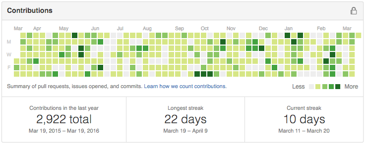
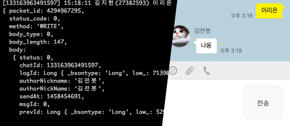

### Education
- <small>2013 - now</small> [Seoul National University, Seoul, Korea][snu]
  - B.S. Student
  - Major in [Computer Science and Engineering][cse]
  - [Server administrator of SNU Dept. of CSE][bacchus]
  - Server administrator of [UPnL]
- <small>2010 - 2013</small> 경기과학고등학교
  - <small>2011</small> 한국정보올림피아드 공모대회 동상

[snu]: http://en.snu.ac.kr/
[cse]: http://cse.snu.ac.kr/en
[bacchus]: https://bacchus.snucse.org/about/
[UPnL]: http://upnl.org/

### Projects
-   [Hard core GitHub <i class="fa fa-github"></i> practitioner][gh]

    [][gh]

-   카톡봇 <i class=private></i>

    

-   [`obj-rs`][obj-rs]

    [

      
    
][obj-rs]

[gh]: https://github.com/simnalamburt
[obj-rs]: https://github.com/simnalamburt/obj-rs

### Skills
- x86 / C / C++
    - 시프
    - 마이크로 최적화
    - RBTree
    - malloc()

- 오델로 AI 만들어봄

- C# C++/CLI

- WinAPI, COM, ATL

- DirectX, OpenGL, Homemade Graphics
    - EasyD3D
    - SoftwareRasterizer

IntelTBB

Linux Server Admin
루비
파이썬
js
Java
Kotlin
OCaml

AngularJS, React, Redux

안드로이드

PS

- MPI, CUDA, OpenCL, OpenMP

node

Rust, Go

VS, vim

- 하드 깃헙 유저

### TODO
- 프로젝트 링크 전부 걸기
    - 깃헙, 깃현미

#### Projects
- [Fate / Another](https://github.com/simnalamburt/fate) *(2014-current)*
- [vim-mundo](https://github.com/simnalamburt/vim-mundo)
- [xmath](https://github.com/simnalamburt/xmath)
- [EasyD3D](https://github.com/simnalamburt/EasyD3D)
- snucheat

#### School works
- [Note-takings](https://github.com/simnalamburt/snucse)
- [My UNIX-like system configuration files](https://github.com/simnalamburt/.dotfiles)
- [Software Rasterizer](https://github.com/simnalamburt/SoftwareRasterizer)
- [Hifive Pitalium Explorer](https://github.com/hifive-snu/hifive-test-explorer)
