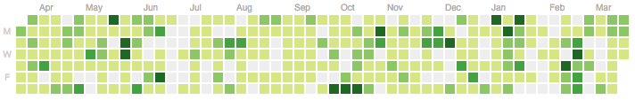

> Open source contributions: **2,919 total** in year 2016

### Curriculum vitae
- <small>2017 - 2019</small> [DEVSISTERS]
- <small>2016</small> [PATI Games]
  - DevOps
  - Server administrator of [아이러브니키]
  - [ISMS] 심사 대응팀
- <small>2014</small> [Byline]
  - Starting Member
  - Main developer, server administrator
- <small>2013 - now</small> [Seoul National University, Seoul, Korea][snu]
  - B.S. Student
  - Major in [Computer Science and Engineering][cse]
  - [Server administrator of SNU Dept. of CSE][bacchus]
  - Server administrator of [UPnL]
- <small>2010 - 2013</small> 경기과학고등학교
  - <small>2011</small> 한국정보올림피아드 공모대회 동상

&nbsp;

Experience
--------
> Most of the work is open source, so you can freely look and verify it.

- #### System Programming <small>x86_64, ARMv7, C, C++, Rust *10*</small>
    - [simnalamburt/tiny-rbtree](https://github.com/simnalamburt/tiny-rbtree),
      C implementation of red-black tree, checked by valgrind
    - [simnalamburt/SoftwareRasterizer][sr], software rasterizer using [Intel TBB]
    - [`mm_malloc()`], hand-made memory allocator
    - [simnalamburt/obj-rs], [Wavefront .obj file] parser for the [Rust]
      programming language
    - [simnalamburt/xmath], Rust port of Microsoft DirectXMath
    - [rust-kr/rust-kr.org](https://github.com/rust-kr/rust-kr.org),
      Korean Rust user group website made in Rust

- #### Server Administration <small>Ubuntu, CentOS, Arch, Windows, ... *13*</small>
    - Experience of large-scale server admin <small>AWS, CCU ~50,000</small>
    - Container orchestration <small>docker, rkt, CoreOS, Kubernetes</small>
    - Currently managing 6 physical servers:
      - [hyeon.me](https://hyeon.me)
      - [kuma.hyeon.me](https://kuma.hyeon.me)
      - [sodrak.upnl.org](https://sodrak.upnl.org)
      - [gemini.upnl.org](https://gemini.upnl.org)
      - uriel.upnl.org <i class=private></i>
      - edhelbroy.upnl.org <i class=private></i>
    - Legacy system experience <small>Solaris 10, IBM AIX 6.1</small>
    - [simnalamburt/nginx.conf](https://github.com/simnalamburt/nginx.conf),
      my nginx configuration, published according to the Kerchoff's principle
    - [simnalamburt/docker-practice](https://github.com/simnalamburt/docker-practice),
      Dockerfile of [snu.jokbo.me](https://snu.jokbo.me/)

- #### Command-line Utilities <small>bash, zsh, fish, vim, ... *13*</small>
    - [simnalamburt/vim-mundo](https://github.com/simnalamburt/vim-mundo),
      vim undo tree visualizer
    - [simnalamburt/shellder](https://github.com/simnalamburt/shellder),
      featured zsh/fish shell theme
    - [simnalamburt/cgitc](https://github.com/simnalamburt/cgitc),
      git abbreviation plugin for bash/zsh/fish
    - [simnalamburt/.dotfiles](https://github.com/simnalamburt/.dotfiles),
      my UNIX-like system configuration files

- #### Software Engineering <small>*04*</small>
    - Ruby <small>Rails, sinatra, unicorn</small>
      - [kollus-ruby](https://github.com/simnalamburt/kollus-ruby),
        [Kollus](https://kollus.com) media API reverse engineering
      - [daumdic-ruby](https://github.com/simnalamburt/daumdic-ruby),
        simple daum dictionary crawler library
      - [simnalamburt/svn-explorer](https://github.com/simnalamburt/svn-explorer),
        dead-simple svn repository explorer
    - Python <small>Flask, SQLAlchemy</small>
      - [snu.jokbo.me], issue sharing service <i class=private></i>
      - [cloudkeeper], IRCCloud reverse engineering
      - [pipenv](https://github.com/pypa/pipenv) contribution:
        [#228](https://github.com/pypa/pipenv/issues/228)
        [#238](https://github.com/pypa/pipenv/pull/238)
    - ECMAScript <small>browser, Node.js</small>
      - node-kakao, KakaoTalk protocol reverse engineering <i class=private></i>
      - [slate/slate-irc](https://github.com/slate/slate-irc), IRC client
        library made to replace
        [node-irc](https://github.com/martynsmith/node-irc) which does not even
        support CJK nickname
      - [wbwwb-ko](https://github.com/simnalamburt/wbwwb-ko), Korean translation
        of a minigame "We Become What We Behold", made by Nicky Case
      - [utatti/pen](https://github.com/utatti/pen/commits?author=simnalamburt)
        contribution:
        [#4](https://github.com/utatti/pen/issues/4)
        [#5](https://github.com/utatti/pen/pull/5)
        [#6](https://github.com/utatti/pen/issues/6)
        [#7](https://github.com/utatti/pen/issues/7)
        [#8](https://github.com/utatti/pen/pull/8)
        [#9](https://github.com/utatti/pen/pull/9)
        [#10](https://github.com/utatti/pen/issues/10)
        [#11](https://github.com/utatti/pen/pull/11)
    - Go
      - [go-mssqldb](https://github.com/denisenkom/go-mssqldb) contribution:
        [#96](https://github.com/denisenkom/go-mssqldb/issues/96)
        [#250](https://github.com/denisenkom/go-mssqldb/pull/250)
    - Rust
      - [texture_packer](https://github.com/PistonDevelopers/texture_packer) contribution:
        [#41](https://github.com/PistonDevelopers/texture_packer/pull/41)
        [#42](https://github.com/PistonDevelopers/texture_packer/pull/42)
        [#43](https://github.com/PistonDevelopers/texture_packer/pull/43)
        [#46](https://github.com/PistonDevelopers/texture_packer/pull/46)
    - Elm
      - [libreirc/elm-crypto](https://github.com/libreirc/elm-crypto), [Web Cryptography API](https://w3c.github.io/webcrypto/Overview.html) for Elm
    - Modern web frontend experience <small>ES2017, CSS4, Webpack 2, TypeScript, Babel, Flow</small>
      - [hyeon.me](https://github.com/simnalamburt/hyeon.me), this resume was
        made with webpack2, cssnext, and markdown
      - [simnalamburt/web-practice](https://github.com/simnalamburt/web-practice),
        Sample app to practice react, redux, and flow
    - Elixir
    - PHP <i class=oh-no></i>

- #### Programming Language Theory <small>*14*</small>
    - Functional programming language experience <small>Rust, OCaml, Haskell, Elm</small>
    - Once contributed to the Rust compiler a little:
      [rust-lang/rust#20460](https://github.com/rust-lang/rust/issues/20460),
      [rust-lang/rust@`9041e6e`](https://github.com/rust-lang/rust/commit/9041e6e0ee)
    - Hand-made [type inferencer for first-order
      logic](https://github.com/simnalamburt/snucse.pl/tree/master/hw4)

- #### Windows Native Programming <small>WinAPI, COM, ATL *11*</small>
    > I was once a hardcore Windows developer, but I'm not anymore.

    - [simnalamburt/EasyD3D](https://github.com/simnalamburt/EasyD3D),
      toy project to wrap Direct3D11 wrapper with C++14
    - [simnalamburt/BinaryToC](https://github.com/simnalamburt/BinaryToC),
      MS COM sample app
    - ActiveX Experience <i class=oh-no></i>

- #### .NET Framework <small>C#, C++/CLI *11*</small>
    - [simnalamburt/FateOne][fo], game helper utility

- #### Supercomputer Programming <small>CUDA, OpenCL, OpenMP, MPI *10*</small>
    - Patching [GADGET-2](https://wwwmpa.mpa-garching.mpg.de/gadget/) for
      simulating nonsymmetrical elliptical galaxy <i class=private></i>
    - GPU-accelerated NegaScout algorithm <i class=private></i>
    - [PARSEC Benchmark Swaption](https://github.com/simnalamburt/snucse.swaptions),
      targetting [Chundoong](http://chundoong.snu.ac.kr/) supercomputer

- #### Computer Graphics <small>D3D, OpenGL *12*</small>

- #### Mobile App Development <small>*11*</small>
    - Android <small>Java, Kotlin</small>
    - iOS <small>Objective-C, Swift</small>
      - [ios-dangerous-webview-practice](https://github.com/simnalamburt/ios-dangerous-webview-practice),
        sample app to practice bypassing iOS App Transport Security

[`mm_malloc()`]:https://github.com/simnalamburt/snucse/tree/master/System%20Programming/malloclab
[Intel TBB]:https://www.threadingbuildingblocks.org/
[simnalamburt/obj-rs]:https://github.com/simnalamburt/obj-rs
[Wavefront .obj file]:https://en.wikipedia.org/wiki/Wavefront_.obj_file
[simnalamburt/xmath]:https://github.com/simnalamburt/xmath
[Rust]: https://www.rust-lang.org

&nbsp;

Featured works
--------
-   #### node-kakao <small>Reverse engineering, Node.js</small> <i class=private></i>

    KakaoTalk Client Library written in [node.js]

    

-   #### [cloudkeeper] <small>Reverse engineering, Python</small>

    Keep IRCCloud connection permenantly without paying a fee

    [][cloudkeeper]

-   #### [snu.jokbo.me] <small>Python</small> <i class=private></i>

    Issue sharing service

    [][snu.jokbo.me]

-   #### [`obj-rs`][obj-rs] <small>Parser, Rust</small>

    Wavefront OBJ parser written in [Rust]

    [][obj-rs]

-   #### [SoftwareRasterizer][sr] <small>C++, IntelTBB</small>

    Homebrewed 3D scene rasterizer without Hardware Acceleration

    [][sr]

-   #### [FateOne][fo] <small>WinAPI, C#</small>

    Game helper made for my own purpose

    [][fo]

-   #### [dotfiles] <small>Linux, shell</small>

    My UNIX-like system configuration files

    [][dotfiles]

-   &nbsp;

    ###### <i class="fa fa-github"></i> Please visit my [GitHub] profile to see more works!

    - [simnalamburt/snucse](https://github.com/simnalamburt/snucse) <small>Note takings</small>
    - [simnalamburt/snippets](https://github.com/simnalamburt/snippets) <small>Small code snippets</small>

[cloudkeeper]: https://github.com/simnalamburt/cloudkeeper
[snu.jokbo.me]: https://snu.jokbo.me

&nbsp;

--------

<small style="display: block">[AGPLv3 License]
  Things are beautiful if you love them. ― _[Jean Anouilh]_
</small>

[DEVSISTERS]: https://www.devsisters.com/
[PATI Games]: https://patigames.com/
[ISMS]: https://isms.kisa.or.kr/main/
[아이러브니키]: https://patigames.com/games/8
[Byline]: https://www.byline.com/
[snu]: http://en.snu.ac.kr/
[cse]: http://cse.snu.ac.kr/en
[bacchus]: https://bacchus.snucse.org/about/
[UPnL]: https://upnl.org/
[GitHub]: https://github.com/simnalamburt
[obj-rs]: https://github.com/simnalamburt/obj-rs
[node.js]: https://nodejs.org/
[Rust]: https://www.rust-lang.org/
[sr]: https://github.com/simnalamburt/SoftwareRasterizer
[fo]: https://github.com/simnalamburt/FateOne
[dotfiles]: https://github.com/simnalamburt/.dotfiles
[Jean Anouilh]: https://en.wikipedia.org/wiki/Jean_Anouilh
[AGPLv3 License]: https://github.com/simnalamburt/hyeon.me/blob/master/LICENSE
