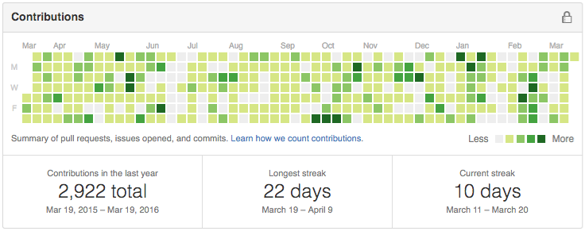

  <i class="fa fa-exclamation-triangle"></i> <b>이 이력서는 미완성입니다.</b> 
  거기, 보고계신 인사담당자님. <a href="javascript:history.back()">뒤로가기</a>를 눌러주세요.

### Education
- <small>2013 - now</small> [Seoul National University, Seoul, Korea][snu]
  - B.S. Student
  - Major in [Computer Science and Engineering][cse]
  - [Server administrator of SNU Dept. of CSE][bacchus]
  - Server administrator of [UPnL]
- <small>2010 - 2013</small> 경기과학고등학교
  - <small>2011</small> 한국정보올림피아드 공모대회 동상

Featured works
--------
-   [Hard core GitHub <i class="fa fa-github"></i> practitioner][gh]

    [][gh]

-   #### node-kakao <i class=private></i>

    KakaoTalk Client Library written in [node.js]

    

-   #### [`obj-rs`][obj-rs]

    Wavefront OBJ parser written in [Rust]

    [

      
    
][obj-rs]

-   #### [SoftwareRasterizer][sr] <small>― C++, IntelTBB</small>

    Homebrewed 3D scene rasterizer without Hardware Acceleration

    [][fo]

-   #### [FateOne][fo] <small>― WinAPI, C#</small>

    Game helper made for my own purpose

    [][fo]

-   #### [dotfiles]

    [][dotfiles]

Skills
--------
- #### System Programming <small>x86_64, C, C++, Rust *10*</small>
    - [simnalamburt/obj-rs][obj-rs]
    - [simnalamburt/tiny-rbtree](https://github.com/simnalamburt/tiny-rbtree)
    - [simnalamburt/SoftwareRasterizer][sr]
    - [Homebrewed `malloc()`](https://github.com/simnalamburt/snucse.malloclab)
    - And countless works that I've done <i class=private></i>

- #### Windows Native Programming <small>WinAPI, COM, ATL *11*</small>
    > I was once hardcore Windows developer, but I'm not anymore.

    - [simnalamburt/EasyD3D](https://github.com/simnalamburt/EasyD3D)
    - [simnalamburt/BinaryToC](https://github.com/simnalamburt/BinaryToC)
    - ActiveX Application <i class=shit></i>

- #### .NET <small>C#, C++/CLI, Mono *11*</small>
    - [simnalamburt/FateOne][fo]

- #### Multi-core Programming <small>CUDA, OpenCL, OpenMP, MPI *12*</small>
    - GPU accelerated [Othello AI] <i class=private></i>
    - [PARSEC Benchmark Swaption](https://github.com/simnalamburt/snucse.swaptions)

- #### Computer Graphics <small>D3D, OpenGL *12*</small>

- #### Server Administrator <small>Ubuntu, Arch *13*</small>

- #### Web <small>Ruby, Go, node.js, ECMAScript, ... *04*</small>
    - PHP <i class=shit></i>
    - AngularJS, React, Redux, ...

- #### Android <small>Java, Kotlin</small>

- #### Vim <small>*13*</small>

- #### Etc <small>OCaml</small>

### TODO
- 프로젝트 링크 전부 걸기
    - 깃헙, 깃현미

#### Projects
- [Fate / Another](https://github.com/simnalamburt/fate) *(2014-current)*
- [vim-mundo](https://github.com/simnalamburt/vim-mundo)
- [xmath](https://github.com/simnalamburt/xmath)
- snucheat

#### School works
- [Note-takings](https://github.com/simnalamburt/snucse)
- [My UNIX-like system configuration files](https://github.com/simnalamburt/.dotfiles)
- [Hifive Pitalium Explorer](https://github.com/hifive-snu/hifive-test-explorer)

[snu]: http://en.snu.ac.kr/
[cse]: http://cse.snu.ac.kr/en
[bacchus]: https://bacchus.snucse.org/about/
[UPnL]: http://upnl.org/
[gh]: https://github.com/simnalamburt
[obj-rs]: https://github.com/simnalamburt/obj-rs
[node.js]: https://nodejs.org/
[Rust]: https://www.rust-lang.org/
[sr]: https://github.com/simnalamburt/SoftwareRasterizer
[fo]: https://github.com/simnalamburt/FateOne
[dotfiles]: https://github.com/simnalamburt/.dotfiles
[Othello AI]: https://en.wikipedia.org/wiki/Computer_Othello
