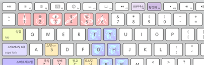

> **2,919 total** ― *Contributions in the last year*

### Education
- <small>2013 - now</small> [Seoul National University, Seoul, Korea][snu]
  - B.S. Student
  - Major in [Computer Science and Engineering][cse]
  - [Server administrator of SNU Dept. of CSE][bacchus]
  - Server administrator of [UPnL]
- <small>2010 - 2013</small> 경기과학고등학교
  - <small>2011</small> 한국정보올림피아드 공모대회 동상

 

Skills
--------
- #### System Programming <small>x86_64, C, C++, Rust *10*</small>
    - [simnalamburt/tiny-rbtree](https://github.com/simnalamburt/tiny-rbtree)
    - [simnalamburt/SoftwareRasterizer][sr]
    - [Homebrewed `malloc()`](https://github.com/simnalamburt/snucse.malloclab)
    - And countless works that I've done

- #### Web <small>Ruby, Go, node.js, ECMAScript, ... *04*</small>
    - Backend
      - Ruby <small>Rails, sinatra, unicorn</small>
      - Python <small>Flask, SQLAlchemy</small>
      - node.js <small>expressjs, mongo</small>
      - Go <small>Rails, sinatra, unicorn</small>
    - Frontend
      - Various frameworks experience <small>React, Redux, AngularJS</small>
      - Modern webdev knowledge <small>ES2015, Webpack, Babel, Flow, SASS, Stylus</small>
      - Old school frontend <small>ES5, jQuery, css</small>
      - [simnalamburt/hyeon.me](https://github.com/simnalamburt/hyeon.me)
      - [simnalamburt/web-practice](https://github.com/simnalamburt/web-practice)
    - [P](https://eev.ee/blog/2012/04/09/php-a-fractal-of-bad-design/)[H](https://noraesae.github.io/PHP-a-fractal-of-bad-design-kr/)[P](http://phpsadness.com/) <i class=shit></i>

- #### Server Administrator <small>Ubuntu, Arch *13*</small>
    - Currently managing 6 servers:
      - [hyeon.me](https://hyeon.me)
      - [kuma.hyeon.me](https://kuma.hyeon.me)
      - [uriel.upnl.org](https://uriel.upnl.org) <i class=private></i>
      - [sodrak.upnl.org](http://sodrak.upnl.org)
      - [gemini.upnl.org](http://gemini.upnl.org)
      - [edhelbroy.upnl.org](http://edhelbroy.upnl.org) <i class=private></i>

- #### Linux Experience <small>bash, zsh, fish, vim, ... *13*</small>
    - [simnalamburt/shellder](https://github.com/simnalamburt/shellder)
    - [simnalamburt/cgitc](https://github.com/simnalamburt/cgitc)
    - [simnalamburt/vim-mundo](https://github.com/simnalamburt/vim-mundo)

- #### Programming Language <small>*14*</small>
    - Functional programming language experience <small>OCaml, Haskell</small>
    - Once contributed to Rust language a little: [rust-lang/rust@`9041e6e`](https://github.com/rust-lang/rust/commit/9041e6e0ee)

- #### Windows Native Programming <small>WinAPI, COM, ATL *11*</small>
    > I was once a hardcore Windows developer, but I'm not anymore.

    - [simnalamburt/EasyD3D](https://github.com/simnalamburt/EasyD3D)
    - [simnalamburt/BinaryToC](https://github.com/simnalamburt/BinaryToC)
    - ActiveX Experience <i class=shit></i>

- #### .NET <small>C#, C++/CLI, Mono *11*</small>
    - [simnalamburt/FateOne][fo]

- #### Multi-core Programming <small>CUDA, OpenCL, OpenMP, MPI *12*</small>
    - GPU-accelerated Othello AI <i class=private></i>
    - [PARSEC Benchmark Swaption](https://github.com/simnalamburt/snucse.swaptions)

- #### Computer Graphics <small>D3D, OpenGL *12*</small>
    - [simnalamburt/obj-rs][obj-rs]
    - [simnalamburt/xmath](https://github.com/simnalamburt/xmath)

- #### Android <small>Java, Kotlin *11*</small>

 

Featured works
--------
-   #### node-kakao <i class=private></i>

    KakaoTalk Client Library written in [node.js]

    

-   #### [`obj-rs`][obj-rs]

    Wavefront OBJ parser written in [Rust]

    [][obj-rs]

-   #### [SoftwareRasterizer][sr] <small>C++, IntelTBB</small>

    Homebrewed 3D scene rasterizer without Hardware Acceleration

    [][sr]

-   #### [FateOne][fo] <small>WinAPI, C#</small>

    Game helper made for my own purpose

    [][fo]

-   #### [dotfiles] <small>Linux, shell</small>

    My own UNIX-like system configuration files

    [][dotfiles]

-    

    ###### <i class="fa fa-github"></i> Please visit my [GitHub] profile to see more works!

    - [simnalamburt/snucse](https://github.com/simnalamburt/snucse) <small>Note takings</small>
    - [simnalamburt/snippets](https://github.com/simnalamburt/snippets) <small>Small code snippets</small>

 

--------

<small style="display: block">
  [AGPLv3 License][li]
  Things are beautiful if you love them. ― *[Jean Anouilh][jean]*
</small>

[snu]: http://en.snu.ac.kr/
[cse]: http://cse.snu.ac.kr/en
[bacchus]: https://bacchus.snucse.org/about/
[UPnL]: http://upnl.org/
[GitHub]: https://github.com/simnalamburt
[obj-rs]: https://github.com/simnalamburt/obj-rs
[node.js]: https://nodejs.org/
[Rust]: https://www.rust-lang.org/
[sr]: https://github.com/simnalamburt/SoftwareRasterizer
[fo]: https://github.com/simnalamburt/FateOne
[dotfiles]: https://github.com/simnalamburt/.dotfiles
[Othello AI]: https://en.wikipedia.org/wiki/Computer_Othello
[jean]: https://en.wikipedia.org/wiki/Jean_Anouilh
[li]: https://github.com/simnalamburt/hyeon.me/blob/master/LICENSE
